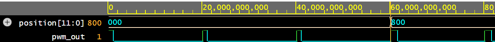

# SiliconArm

An FPGA-controlled robotic arm on a custom-designed PCB — a portfolio project built to demonstrate both ASIC-design-adjacent skills (SystemVerilog RTL, closed-loop control, simulation/verification) and PCB-hardware-engineering skills (schematic capture, layout, fabrication, bring-up), without committing to either career track ahead of internship season.

Full design rationale, alternatives considered, and phased plan: [`DESIGN.md`](DESIGN.md).

## Status: Phase 0 complete (simulation), Phase 1 not yet started

Phase 0 — a single joint's closed-loop control datapath — is designed and fully verified in simulation, with no physical hardware purchased yet (deliberately: validate in simulation first, buy parts second). See [`docs/PHASE0_NOTES.md`](docs/PHASE0_NOTES.md) for two real bugs found and fixed along the way, and [`SKILLS_LOG.md`](SKILLS_LOG.md) for what was learned.



`position[11:0]` steps from `000` to `800` mid-simulation — note `pwm_out`'s pulse width visibly widening right after, proving the commanded position actually controls servo pulse width. Captured in [EDA Playground](https://www.edaplayground.com) running the same Icarus Verilog testbench as `scripts/run_sims.sh`.

```
rtl/pwm_generator.sv           50 Hz servo PWM generator
rtl/spi_adc_reader.sv          SPI master reading position feedback (MCP3208-class ADC)
rtl/p_controller.sv            Discrete-time proportional position controller
rtl/single_joint_controller.sv Top-level: wires the above into one closed control loop

sim/*_tb.sv                    Self-checking testbenches (one per module + one integration test)
sim/mcp3208_model.sv           Behavioral ADC model used only in simulation

scripts/run_sims.sh            Compiles and runs every testbench, prints a pass/fail summary
```

## Running the simulations

Requires [Icarus Verilog](https://bleyer.org/icarus/) (`iverilog` + `vvp`) on PATH.

```sh
./scripts/run_sims.sh
```

Expected: `4/4 testbenches passed`.

## Roadmap

- **Phase 0 (done):** simulate the single-joint closed-loop control datapath before buying anything.
- **Phase 1 (next):** buy an FPGA dev board + servo/ADC, design and fab PCB rev 1 (single joint), bring up real hardware against the simulated behavior.
- **Phase 2:** multi-joint arm with a custom communication protocol, PCB rev 2.
- **Phase 3 (stretch):** real-time vision tracking implemented directly in HDL.
